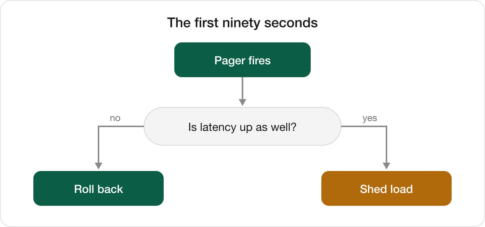
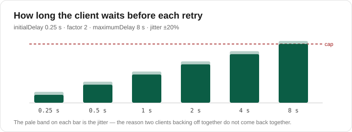

# Pictures in a document

Repository documents are rarely only words.
A runbook has a flow chart, a design note has a mock-up, a README has a badge — and a reading app that drops all of them is showing you a different document from the one that was written.

This page is the proof that they arrive: a PNG, an SVG, and an icon sized by hand.

⚠️ **The words are stored on your device and the pictures are not.**
Every sample carries its text inside the app, so it opens on a plane.
The images below are fetched from the repository the moment you open this page, which is the only way an image can stay current — so this one page, alone among the samples, wants a connection.

## A flow chart, as PNG

The first ninety seconds of an incident, from the runbook beside this file.

A raster, exported at twice its drawn size so it stays crisp on a Retina screen.

## The same repository, as SVG

How long a client waits before each retry, under the policy in `Sources/RetryPolicy.swift`.

Vector, so it is drawn at whatever size the column happens to be rather than scaled from a bitmap.

⭐ Both diagrams paint their own white card instead of sitting on a transparent background — the reader chooses the paper, and dark ink on nothing disappears on a dark one.

## An icon, sized by hand

Markdown has no way to set an image's width, so a document that needs one drops into HTML:

That is this repository's own icon, referenced from the folder *above* this one — a relative path with a `..` in it, which is exactly the kind that breaks when a document is read anywhere other than its own checkout.

## What is being tested here

| The picture | How it is written | What it exercises |
| --- | --- | --- |
| `images/Incident-triage.png` | Markdown `` | a raster beside the document |
| `images/Backoff-timeline.svg` | Markdown `` | a vector, drawn at the column's width |
| `../assets/icons/icon.svg` | raw HTML `` | a path that climbs out of this folder, and an explicit width |

---

*This document is a sample shipped with Multirepo Reader.*
